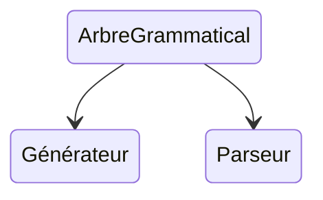
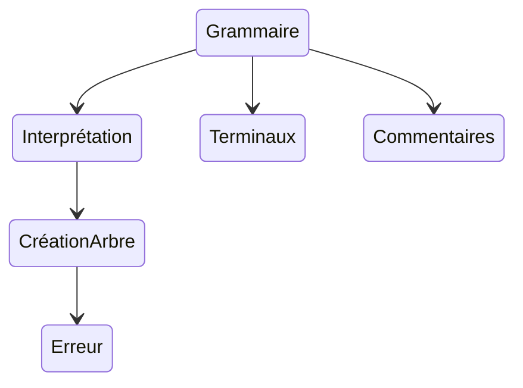

# TODO

**Important** : les graphiques sont décrit en Mermaid, pour un meilleur visionnage, privilégiez [Typora](typora.io).


## Guide de travail

**Refaire les versions en fonction de :**

* lexeur du fichier d'entrée (liste)
* parseur du fichier d'entrée
* dictionnaire de la grammaire (simultané)

**Ensuite** on s'occupera de la génération et du parsage


* **v0.0** : analyseur lexical pour le fichier d'entrée
* **v0.1** : analyseur syntaxique pour le fichier d'entrée


* représenter les graphes sous forme de dictionnaire
* lecture à partir d'un fichier


* v0.1 : revoir diff lexer parser
  * ident > place
  * et / ou
  * fin de ligne
  * espaces blancs et sauts de ligne

Exemple :

```gram
ident > lettre any
any > lettre | chiffre | '_'
lettre > majus | minus
majus > 'A'|'B'|'C'|'D'|'E'
minus > 'a'|'b'|'c'|'d'|'e'
chiff > '1'|'2'|'3'|'4'
```

Grammaire :

```gram
grammaire > definition | grammaire retour definition
retour > 'CR' | 'LF' | 'CRLF'
definition > Ident '>' place
place > ident | place place | place '|' place | '(' place ')'
ident > caract ident | caract
caract > lettre | chiffre | '_'
lettre > majus | minus
majus > 'A' | 'B' | 'C' | 'D' | 'E'
minus > 'a' | 'b' | 'c' | 'd' | 'e'
chiffre > '1' | '2' | '3' | '4'
```


* v1.0
  * caractères échappés
  * commentaires
  * intervalles
* v1.1
  * 
* v0.4


Réalisation des tests :

* analyseur lexical

1. on charge le fichier
2. on lit tous les caractères
3. on créé une liste de tous les lexèmes


## Généralités

Ce projet de générateur va contenir trois tâches essentielles :

* la création d'un arbre grammatical à partir de la grammaire
* la création d'un générateur du langage défini par la grammaire
* la création d'un parseur du langage défini par la grammaire



## Arbre grammatical

* **grammaire** : définir une grammaire pour les fichiers de grammaire à traiter
* **interprétation** : interpréter un fichier de grammaire
* **création d'arbre** : créer l'arbre grammatical correspondant au fichier
* **erreurs** : donner les erreurs et avertissement sur l'arbre
* **terminaux** : donner une définition pour les terminaux, prédéfinir certains non terminaux comme ensemble de terminaux
* **commentaires** : définir la mise en place dans la grammaire des commentaires, créer un nœud spécial 




## Générateur

## Parseur


