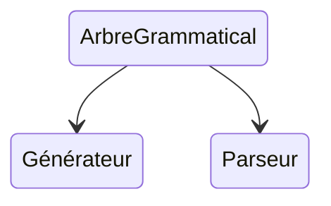
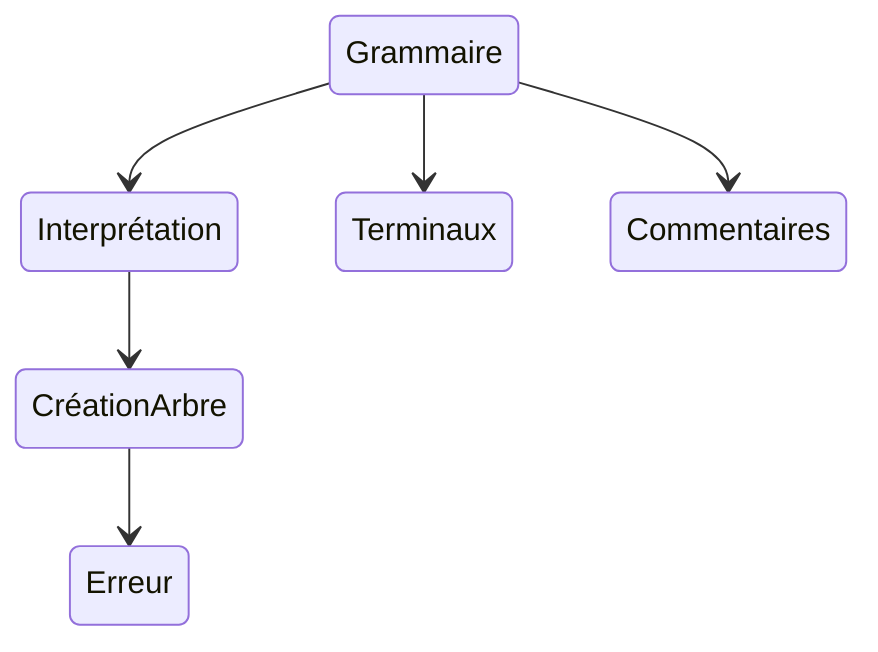

# Tâches

## Généralités

Ce projet de générateur va contenir trois tâches essentielles :

* la création d'un arbre grammatical à partir de la grammaire
* la création d'un générateur du langage défini par la grammaire
* la création d'un parseur du langage défini par la grammaire

## Arbre grammatical

* La grammaire : définir une grammaire pour les fichiers de grammaire à traiter
* L'interprétation : interpréter un fichier de grammaire
* La création d'arbre : créer l'arbre grammatical correspondant au fichier
* Les erreurs : donner les erreurs et avertissement sur l'arbre
* Les terminaux : donner une définition pour les terminaux, prédéfinir certains non terminaux comme ensemble de terminaux
* Les commentaires : définir la mise en place dans la grammaire des commentaires, créer un nœud spécial 

## Générateur

## Parseur

